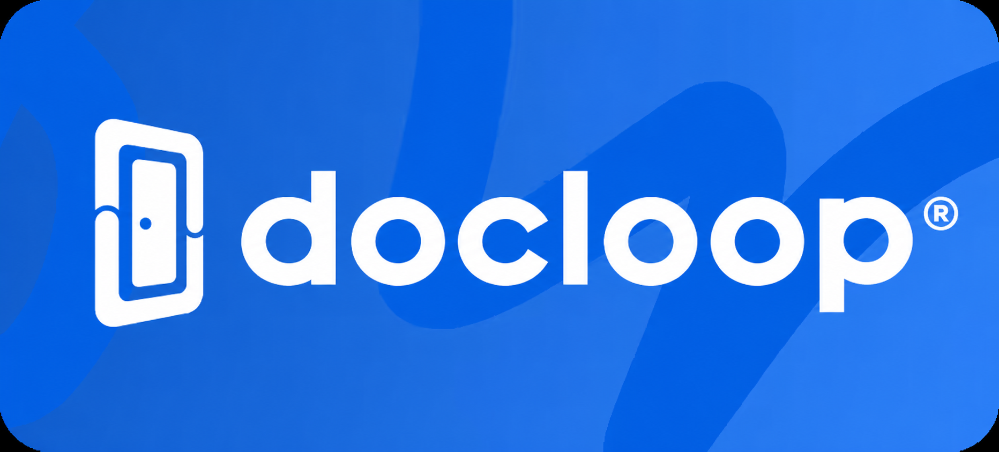

<div align="center">



### Documentation that maintains itself.

A GitHub Action that keeps your docs in sync with your codebase using AI — every merged PR, automatically.

[](https://github.com/doorloop/ai-docloop/releases)
[](https://github.com/marketplace/actions/docloop-ai)
[](https://github.com/doorloop/ai-docloop/actions/workflows/quality.yml)
[](./LICENSE)
[](https://www.doorloop.com)

[Quick start](#-quick-start) · [Concept](#-concept) · [Inputs](#-inputs) · [Routing modes](#-routing-modes) · [Examples](./examples/)

</div>

---

## Why DocLoop

Documentation rots the moment it ships. Every refactor, every renamed function, every new flag — the docs drift, the team loses trust in them, and onboarding pays the cost. DocLoop closes the loop: the same PR that changes the code also produces the doc update, reviewed by the engineer who shipped it. No new tools, no new dashboards, no separate cadence — just a step in the workflow you already run.

**Why teams pick it up:**

- 📦 **Single-step install** — one `uses:` line in your workflow, no config files, no shell heredocs.
- 🔁 **One step = one mapping intent** — compose several docs surfaces by adding more steps.
- 🎯 **Two routing modes** — placeholder fan-out for clean 1:1 mappings, frontmatter-driven candidate routing for messy M:N reality.
- 🧠 **Bring your own prompt** — point at a Markdown file in your repo; it becomes the model's primary directive.
- 🧭 **No-churn updates** — the model can opt out of trivial changes via the structured `should_update` signal or the `<!-- docloop:no-update -->` sentinel.
- 🚀 **Four delivery modes** — direct commit, separate docs PR, in-PR commit, or read-only preview comment.
- 🤝 **Auto-routed reviews** — the docs PR is automatically reviewed by the source PR author, no manual triage.

> [!TIP]
> Just want to try it? Drop the [quick-start workflow](#-quick-start) into `.github/workflows/docloop.yml`, add `OPENAI_API_KEY` to your repo secrets, and merge any PR that touches a watched directory.

---

## Table of contents

- [⚡ Quick start](#-quick-start)
- [🧩 Concept](#-concept)
- [📥 Inputs](#-inputs)
- [🎬 Behavior by event](#-behavior-by-event)
- [🛣️ Routing modes](#-routing-modes)
    - [Placeholder fan-out](#placeholder-fan-out)
    - [Candidate routing (`readme_candidates`)](#candidate-routing-readme_candidates)
- [✍️ Authoring prompts](#-authoring-prompts)
- [🧪 The update signal](#-the-update-signal)
- [🧱 Composing multiple intents](#-composing-multiple-intents)
- [📚 Examples](#-examples)
- [🛠️ Development](#-development)
- [🔄 Versioning & compatibility](#-versioning--compatibility)
- [📜 License](#-license)

---

## ⚡ Quick start

Add `.github/workflows/docloop.yml` to the consumer repo:

```yaml
name: Maintain READMEs

on:
    pull_request:
        types: [closed]

jobs:
    docs:
        if: github.event.pull_request.merged == true
        runs-on: ubuntu-latest
        permissions:
            contents: write
            pull-requests: write
        steps:
            - uses: actions/checkout@v4
              with:
                  fetch-depth: 0

            - uses: doorloop/ai-docloop@v2
              with:
                  openai_api_key: ${{ secrets.OPENAI_API_KEY }}
                  watch: src/features/<FEATURE>/**
                  readme: src/features/<FEATURE>/README.md
```

Add `OPENAI_API_KEY` to **Settings → Secrets and variables → Actions**, then merge a PR that touches any feature directory. That's it — three required inputs, no config file.

> [!IMPORTANT]
> The job needs `permissions: { contents: write, pull-requests: write }` for the action's default `github_token` to commit and open PRs. Override via the `github_token` input only when you need cross-repo writes via a PAT.

---

## 🧩 Concept

A mapping says: _"watch these source paths, maintain this documentation file."_

```yaml
- uses: doorloop/ai-docloop@v2
  with:
      openai_api_key: ${{ secrets.OPENAI_API_KEY }}
      watch: apps/server/features/<FEATURE_NAME>/**
      readme: docs/wiki/insights/<FEATURE_NAME>-feature.md
```

When a PR touches `apps/server/features/inspections/index.ts`, `<FEATURE_NAME>` captures `inspections` and the action targets `docs/wiki/insights/inspections-feature.md`. Multiple captures (`apps/<APP>/features/<FEATURE_NAME>/**`) work too.

A workflow is a flat list of mappings — one step per intent. Triggers come from the workflow's own `on:` and `if:`; the action introspects the actual GitHub event to decide what to do.

---

## 📥 Inputs

| Input                           | Required | Default                                  | Purpose                                                                                                                                                                                       |
| ------------------------------- | -------- | ---------------------------------------- | --------------------------------------------------------------------------------------------------------------------------------------------------------------------------------------------- |
| `openai_api_key`                | yes      | —                                        | OpenAI API key (store in GitHub secrets).                                                                                                                                                     |
| `openai_model`                  | no       | `gpt-4o-mini`                            | Model identifier. Override if your OpenAI project doesn't have access to the default.                                                                                                         |
| `github_token`                  | no       | `${{ github.token }}`                    | Token for PR file lists, commits, PRs, and comments. Override only for cross-repo writes via PAT.                                                                                             |
| `watch`                         | yes      | —                                        | One or more glob patterns (newline- or comma-separated). May contain `<PLACEHOLDER>` segments for fan-out.                                                                                    |
| `readme`                        | yes\*    | —                                        | Target documentation path. Any `<PLACEHOLDER>` here must be declared in `watch`. Mutually exclusive with `readme_candidates`.                                                                 |
| `readme_candidates`             | yes\*    | —                                        | Glob matching candidate docs whose YAML frontmatter declares the source paths each one owns. See [Candidate routing](#candidate-routing-readme_candidates). Mutually exclusive with `readme`. |
| `prompt_file`                   | no       | —                                        | Path to a Markdown file used as the model's primary directive.                                                                                                                                |
| `detail_level`                  | no       | `medium`                                 | `low` \| `medium` \| `high`.                                                                                                                                                                  |
| `format`                        | no       | `structured`                             | `structured` (JSON with `should_update`) or `freeform` (Markdown with the `<!-- docloop:no-update -->` sentinel).                                                                             |
| `on_missing_readme`             | no       | `create`                                 | `create` or `skip` — what to do when the target file does not exist.                                                                                                                          |
| `exclude`                       | no       | —                                        | Glob patterns to exclude from the watch set (newline- or comma-separated).                                                                                                                    |
| `delivery`                      | no       | event-derived†                           | `direct_commit` \| `pr` \| `pr_comment` \| `pr_branch_commit`.                                                                                                                                |
| `commit_message`                | no       | `docs: update [skip ci]`                 | Used for `direct_commit`, `pr`, and `pr_branch_commit` deliveries.                                                                                                                            |
| `pr_title`                      | no       | `📚 docs: update READMEs via DocLoop AI` | Title for the docs PR opened when `delivery: pr`.                                                                                                                                             |
| `request_review_from_pr_author` | no       | `true`                                   | When `delivery: pr` fires from a merged PR, request a review on the docs PR from the source PR author. Set to `false` to disable.                                                             |
| `name`                          | no       | derived from `watch`+`readme`            | Mapping name; keys per-step PR-preview comments so multi-step workflows keep their comments idempotent.                                                                                       |

<sub>\* Exactly one of `readme` or `readme_candidates` must be set.</sub><br/>
<sub>† Default `delivery`: closed-merged PR → `direct_commit`; opened/synchronize/reopened PR → `pr_comment`; `workflow_dispatch` → `pr`.</sub>

---

## 🎬 Behavior by event

| Workflow event                                       | Action behavior                                     | Allowed deliveries                                                            |
| ---------------------------------------------------- | --------------------------------------------------- | ----------------------------------------------------------------------------- |
| `pull_request` `closed` && `merged==true`            | Process the PR's changed files and ship the result. | `direct_commit`, `pr`                                                         |
| `pull_request` `opened` / `synchronize` / `reopened` | Process the PR's changed files and post a preview.  | `pr_comment`, `pr_branch_commit` (auto-degrades to `pr_comment` for fork PRs) |
| `workflow_dispatch`                                  | Process every tracked file in the repo.             | `direct_commit`, `pr`                                                         |
| Any other event                                      | No-op (logs and exits 0).                           | —                                                                             |

The action validates `delivery` against the event and fails loudly on illegal combos.

---

## 🛣️ Routing modes

DocLoop offers two ways to connect changed source files to documentation files. Pick whichever matches the shape of your codebase.

### Placeholder fan-out

The simple case: one source dir maps cleanly to one doc file. Use `<PLACEHOLDER>` syntax in both `watch` and `readme`:

```yaml
watch: apps/<APP>/features/<FEATURE_NAME>/**
readme: docs/<APP>/<FEATURE_NAME>.md
```

A PR touching `apps/server/features/auth/index.ts` and `apps/client/features/billing/index.ts` produces two separate generations: `docs/server/auth.md` and `docs/client/billing.md`. Files that share the same captures share one OpenAI call.

**Rules:**

- Placeholders are uppercase identifiers (`<NAME>`, `<FEATURE_NAME>`, `<APP_2>` …).
- Every placeholder used in `readme` must be declared in `watch`.
- All `watch` entries must declare the same placeholder set (they unify into one fan-out).

### Candidate routing (`readme_candidates`)

Real codebases get messier. A single feature dir might own multiple insight files (server vs. client splits). One doc file might claim several unrelated source globs (a feature plus its constants plus its rabbitmq queues). Naming conventions can diverge from directory structure (camelCase dirs, kebab-case docs).

Replace `readme:` with `readme_candidates:` — a static glob that matches every candidate file. Each candidate then declares its own source ownership in YAML frontmatter:

```markdown
---
title: Inspections — Critical Insights
paths:
    - apps/server/src/features/inspections/**
    - apps/server/src/jobs/dataModels/inspectionJob.ts
---

# … body …
```

The action expands `readme_candidates`, parses every candidate's frontmatter, builds an inverse index of `source_glob → [candidate_paths]`, and routes each changed source file to every candidate that claims it. One source change can fan out to multiple docs; one doc can collect changes from multiple unrelated source paths.

```yaml
- uses: doorloop/ai-docloop@v2
  with:
      openai_api_key: ${{ secrets.OPENAI_API_KEY }}
      watch: |
          apps/server/src/features/**
          apps/client/src/features/**
      readme_candidates: docs/wiki/insights/*-feature.md
      prompt_file: docs/wiki/insights/PROMPT.md
      format: freeform
      delivery: pr
```

A changed source file must clear three gates to fire docloop:

1. **`watch`** — in the workflow's stated scope of attention.
2. **`exclude`** — not blocked by the deny-list.
3. **A candidate's `paths:`** — claimed by at least one candidate doc.

> [!NOTE]
> Candidates that lack frontmatter or have an empty `paths:` array are skipped with a warning — the action never invents a routing target. Path-injection is impossible: the matched set is constrained to the glob expansion done at action time.

---

## ✍️ Authoring prompts

Set `prompt_file` to point at a Markdown file in your repo. Its contents become the **primary** directive for the model; the action's operational boundaries (return JSON / return Markdown / how to signal "no update") are appended after. This lets your team own the agent's brief while the action keeps the protocol consistent.

```yaml
prompt_file: docs/prompts/insights.md
```

Any prompting style works — directives, few-shot examples, custom audit lenses, citation rules. The model receives:

1. Your `prompt_file` content (verbatim).
2. The action's appended boundaries.
3. A user message containing: feature name, detail level, list of changed file paths, PR title/body (if on a PR event), and the existing target file's content (when present).

> [!IMPORTANT]
> The action does **not** recursively expand links, follow `[[wikilinks]]`, or read files referenced inside the prompt. Only the `prompt_file` itself and the changed source-file paths reach the model. If you want richer context, send PRs against the [feature backlog](https://github.com/doorloop/ai-docloop/issues).

---

## 🧪 The update signal

DocLoop includes an opt-out for trivial changes so your repo doesn't get spammed with no-op docs commits.

| Format       | Sentinel for "no update"                                                  |
| ------------ | ------------------------------------------------------------------------- |
| `structured` | `{ "should_update": false, "update_reason": "<one line>" }` in the JSON   |
| `freeform`   | The literal string `<!-- docloop:no-update -->` returned as the only body |

When the model emits the sentinel, the action skips the write and the delivery side-effect. The skip is logged with the reason so it shows up in the run output.

---

## 🧱 Composing multiple intents

A single workflow can maintain several documentation surfaces by adding more steps:

```yaml
on:
    pull_request:
        types: [opened, synchronize, reopened, closed]

jobs:
    docs:
        runs-on: ubuntu-latest
        permissions:
            contents: write
            pull-requests: write
        steps:
            - uses: actions/checkout@v4
              with:
                  fetch-depth: 0

            - name: Maintain feature insights
              uses: doorloop/ai-docloop@v2
              with:
                  openai_api_key: ${{ secrets.OPENAI_API_KEY }}
                  watch: apps/server/features/<FEATURE_NAME>/**
                  readme: docs/wiki/insights/<FEATURE_NAME>-feature.md
                  prompt_file: docs/prompts/insights.md
                  detail_level: high
                  format: freeform
                  on_missing_readme: skip
                  delivery: pr

            - name: Maintain component READMEs
              uses: doorloop/ai-docloop@v2
              with:
                  openai_api_key: ${{ secrets.OPENAI_API_KEY }}
                  watch: apps/client/src/components/<COMPONENT>/**
                  readme: apps/client/src/components/<COMPONENT>/README.md
                  prompt_file: docs/prompts/components.md
                  delivery: direct_commit
```

Steps run sequentially in one job — no git contention. Each step is independent: separate prompt, detail level, delivery, exclude rules, and PR title. PR-preview comments are keyed on each step's `name` so they update idempotently in multi-step PRs.

---

## 📚 Examples

| File                                                         | Pattern                                                                                                     |
| ------------------------------------------------------------ | ----------------------------------------------------------------------------------------------------------- |
| [`examples/single-step.yml`](./examples/single-step.yml)     | Minimum-viable invocation — one mapping, default delivery, no prompt file.                                  |
| [`examples/wiki-insights.yml`](./examples/wiki-insights.yml) | Multi-step composition — feature insights delivered as a PR, component READMEs delivered as direct commits. |

Each file is a complete `.github/workflows/*.yml` you can drop into a consumer repo unchanged.

---

## 🛠️ Development

### Prerequisites

- [Bun](https://bun.sh) ≥ 1.1
- Node.js ≥ 20 (only contributors who run the local `act` flow need a Node install — consumers don't)

### Common commands

```bash
bun install
bun run build           # bundle src/ into dist/index.js
bun run typecheck       # tsc --noEmit
bun test                # bun test --coverage for lcov
bun run lint            # oxlint
bun run lint:fix
bun run format          # oxfmt --write
bun run format:check
bun run knip            # detect unused exports / files / deps
```

Husky hooks installed via `bun install` enforce formatting + linting on staged files (`pre-commit`) and conventional-commit messages (`commit-msg`).

### Testing the action locally

See [`TESTING.md`](./TESTING.md) for the [`act`](https://github.com/nektos/act) workflow that runs the action against simulated PR events without pushing to GitHub.

### Contributing

PRs welcome. The `quality.yml` workflow runs lint, format, typecheck, knip, tests, audit, and build on every PR. Conventional-commit messages drive the release version (`feat:` minor, `fix:` patch, `feat!:` major).

---

## 🔄 Versioning & compatibility

- **Pin to a major** for stable consumer workflows: `uses: doorloop/ai-docloop@v2`. The moving `v$MAJOR` tag follows every patch and minor automatically.
- **Pin to an exact tag** for fully deterministic runs: `uses: doorloop/ai-docloop@v2.2.1`.
- **Action runtime is Node 20.** The bundled `dist/index.js` is committed and self-contained — consumers run no install step.
- **Releases are commit-driven.** Every push to `main` triggers semantic-release; `CHANGELOG.md` and the moving major tag update automatically.

---

## 📜 License

[MIT](./LICENSE) — © [DoorLoop](https://www.doorloop.com)

---

<div align="center">


**Built with care by the team at [DoorLoop](https://www.doorloop.com).**

If DocLoop helped your team keep their docs honest, [⭐ star the repo](https://github.com/doorloop/ai-docloop) — it's the cheapest way to say thanks.

</div>
